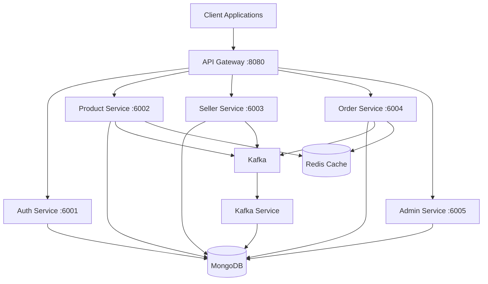

# NextBuy Microservice Architecture

## Overview

NextBuy is a microservices-based e-commerce platform built with Node.js, TypeScript, and Express. The architecture follows microservices best practices with clear separation of concerns.

## Architecture Diagram



## Services

### API Gateway (Port 8080)
- **Purpose**: Single entry point for all client requests
- **Features**:
  - Request routing
  - Service discovery
  - Circuit breaker pattern
  - Health checks
  - Rate limiting
  - Request/response logging

### Auth Service (Port 6001)
- **Purpose**: Authentication and authorization
- **Responsibilities**:
  - User registration and login
  - Seller registration and login
  - Admin authentication
  - JWT token management
  - Password reset
  - User profile management

### Product Service (Port 6002)
- **Purpose**: Product catalog management
- **Responsibilities**:
  - Product CRUD operations
  - Product variations
  - Product moderation
  - Product search and filtering
  - Category management
  - Image upload

### Seller Service (Port 6003)
- **Purpose**: Seller and shop management
- **Responsibilities**:
  - Shop creation and management
  - Seller verification
  - Discount codes
  - Stripe account management
  - Shop profile management

### Order Service (Port 6004)
- **Purpose**: Order processing and payment
- **Responsibilities**:
  - Order creation
  - Payment processing (Stripe)
  - Order status management
  - Delivery tracking
  - Order history

### Admin Service (Port 6005)
- **Purpose**: Administrative functions
- **Responsibilities**:
  - Product moderation
  - Seller verification
  - System configuration
  - Analytics and reporting

### Kafka Service
- **Purpose**: Event processing
- **Responsibilities**:
  - Notification events
  - User analytics events
  - Event consumption and processing

## Communication Patterns

### Synchronous Communication
- **HTTP/REST**: Used for request/response patterns
- **API Gateway**: Routes requests to appropriate services
- **Service Clients**: Internal clients for inter-service communication

### Asynchronous Communication
- **Kafka**: Used for event-driven communication
- **Event Types**:
  - Notification events
  - User analytics events
  - Product events

## Data Management

### Database Strategy
- **Current**: Shared MongoDB database (to be migrated to database-per-service)
- **ORM**: Prisma
- **Models**: Users, Products, Orders, Shops, Sellers, Admins

### Caching
- **Redis**: Used for session management and caching
- **Payment Sessions**: Stored in Redis with TTL

## Code Organization

### Standard Structure
```
apps/{service}/src/
├── controllers/     # HTTP request handlers
├── services/        # Business logic
├── repositories/    # Data access
├── dto/            # Data Transfer Objects
├── routes/         # Route definitions
└── main.ts         # Entry point
```

### Shared Packages
- `@packages/base`: Base classes (Controller, Service, Repository)
- `@packages/middleware`: Common middleware (auth, CORS, health checks)
- `@packages/contracts`: API contracts and event schemas
- `@packages/clients`: Service clients for inter-service communication
- `@packages/libs`: Shared libraries (Prisma, Redis, ImageKit)
- `@packages/error-handler`: Error handling utilities

## Security

### Authentication
- JWT tokens (access + refresh)
- HttpOnly cookies for token storage
- Role-based access control (RBAC)

### Authorization
- Middleware: `isAuthenticated`, `isSeller`, `isAdmin`
- Service-level permission checks

## Monitoring & Observability

### Health Checks
- `/health`: Basic health check
- `/health/ready`: Readiness probe (checks dependencies)
- `/health/live`: Liveness probe

### Logging
- Structured logging with service name
- Request ID tracking
- Error logging with stack traces

### Metrics
- Service health status
- Request/response times
- Error rates

## Deployment

### Development
- All services run locally
- Docker Compose for infrastructure (Kafka, Zookeeper)
- Nx monorepo for code organization

### Production Considerations
- Service discovery (Consul/Eureka)
- Load balancing
- Database per service
- Container orchestration (Kubernetes)
- CI/CD pipeline

## Future Improvements

1. **Database per Service**: Migrate from shared database
2. **Service Mesh**: Implement service mesh for advanced traffic management
3. **Event Sourcing**: For audit trails and event replay
4. **Saga Pattern**: For distributed transactions
5. **API Versioning**: Support multiple API versions
6. **GraphQL Gateway**: Consider GraphQL for flexible queries

