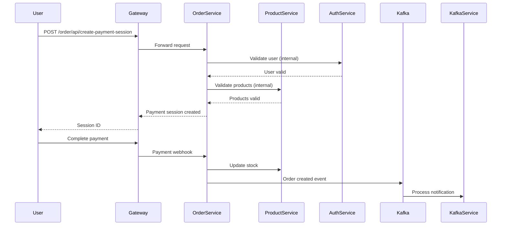
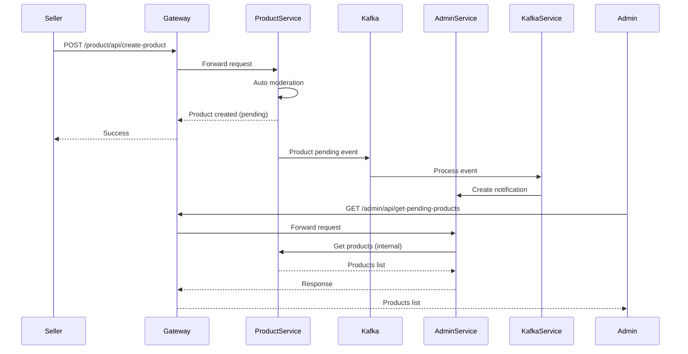

# Service Interaction Patterns

## Overview
This document describes how services interact with each other in the NextBuy platform.

## Interaction Types

### 1. Synchronous HTTP Calls (via API Gateway)

```
Client -> API Gateway -> Service
```

**Use Cases**:
- User-initiated actions
- Real-time data retrieval
- Immediate responses required

**Example**: User creates an order
```
User -> API Gateway -> Order Service -> Product Service (validate) -> Order Service (create)
```

### 2. Asynchronous Events (via Kafka)

```
Service A -> Kafka -> Kafka Service -> Service B
```

**Use Cases**:
- Notifications
- Analytics
- Non-critical updates
- Event sourcing

**Example**: Product created notification
```
Product Service -> Kafka (product.created) -> Kafka Service -> Admin Service (notification)
```

### 3. Direct Service-to-Service (Internal APIs)

```
Service A -> Service B (internal endpoint)
```

**Use Cases**:
- Service clients for validation
- Data fetching between services
- Internal operations

**Example**: Order service validates product
```
Order Service -> Product Client -> Product Service (internal API)
```

## Service Dependencies

### Order Service
- **Depends on**:
  - Auth Service: Validate user
  - Product Service: Validate products, update stock
  - Seller Service: Get shop information

### Product Service
- **Depends on**:
  - Auth Service: Validate seller
  - Seller Service: Validate shop ownership

### Seller Service
- **Depends on**:
  - Auth Service: Validate seller authentication

### Admin Service
- **Depends on**:
  - Auth Service: Validate admin
  - Product Service: Get products for moderation
  - Seller Service: Get sellers for verification

## Communication Flow Examples

### Example 1: Create Order



### Example 2: Product Moderation



## Best Practices

1. **Use API Gateway for external requests**: All client requests go through the gateway
2. **Use service clients for internal calls**: Type-safe internal communication
3. **Use Kafka for events**: Decouple services for async operations
4. **Validate in service layer**: Don't trust data from other services
5. **Handle failures gracefully**: Use circuit breakers and retries
6. **Log all interactions**: Track service-to-service calls for debugging

## Error Handling

### Synchronous Calls
- Return appropriate HTTP status codes
- Include error details in response
- Log errors with context

### Asynchronous Events
- Implement idempotency
- Handle event failures gracefully
- Use dead letter queues for failed events

## Performance Considerations

1. **Caching**: Cache frequently accessed data (Redis)
2. **Connection Pooling**: Reuse database connections
3. **Async Operations**: Use async/await for I/O operations
4. **Batch Operations**: Group multiple operations when possible
5. **Circuit Breakers**: Prevent cascading failures

