# Quy trình Nghiệp vụ trong Hệ thống NextBuy

## Tổng quan

Hệ thống NextBuy là một nền tảng thương mại điện tử đa bên (multi-sided platform) kết nối người mua, người bán và quản trị viên. Dưới đây là các quy trình nghiệp vụ chính được triển khai trong hệ thống.

## 1. Quy trình Xác thực & Quản lý Người dùng

### 1.1 Đăng ký Người dùng mới

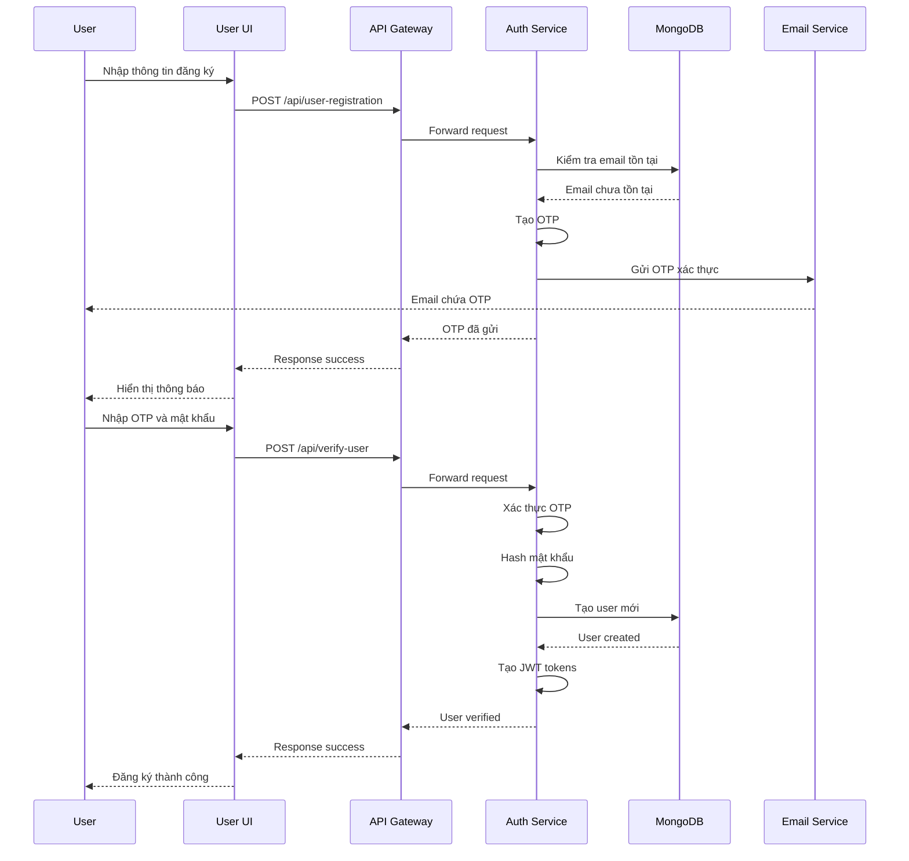
```mermaid
sequenceDiagram
    participant U as User
    participant UI as User UI
    participant GW as API Gateway
    participant AS as Auth Service
    participant DB as MongoDB
    participant Email as Email Service
    
    U->>UI: Nhập thông tin đăng ký
    UI->>GW: POST /api/user-registration
    GW->>AS: Forward request
    AS->>DB: Kiểm tra email tồn tại
    DB-->>AS: Email chưa tồn tại
    AS->>AS: Tạo OTP
    AS->>Email: Gửi OTP xác thực
    Email-->>U: Email chứa OTP
    AS-->>GW: OTP đã gửi
    GW-->>UI: Response success
    UI-->>U: Hiển thị thông báo
    
    U->>UI: Nhập OTP và mật khẩu
    UI->>GW: POST /api/verify-user
    GW->>AS: Forward request
    AS->>AS: Xác thực OTP
    AS->>AS: Hash mật khẩu
    AS->>DB: Tạo user mới
    DB-->>AS: User created
    AS->>AS: Tạo JWT tokens
    AS-->>GW: User verified
    GW-->>UI: Response success
    UI-->>U: Đăng ký thành công
```

**Các bước chi tiết:**
1. User nhập thông tin (name, email) vào form đăng ký
2. Auth Service kiểm tra email đã tồn tại chưa
3. Tạo OTP ngẫu nhiên và gửi qua email
4. User nhập OTP và mật khẩu
5. Xác thực OTP và hash mật khẩu với bcrypt
6. Lưu user vào database với trạng thái đã xác thực
7. Tạo access token (15 phút) và refresh token (7 ngày)
8. Lưu tokens vào httpOnly cookies

### 1.2 Đăng nhập Người dùng

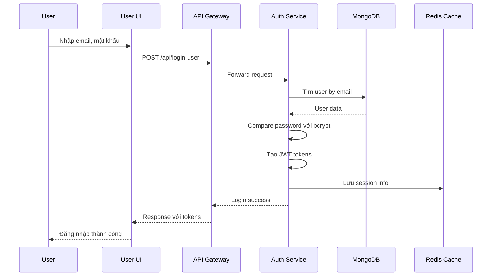
```mermaid
sequenceDiagram
    participant U as User
    participant UI as User UI
    participant GW as API Gateway
    participant AS as Auth Service
    participant DB as MongoDB
    participant Redis as Redis Cache
    
    U->>UI: Nhập email, mật khẩu
    UI->>GW: POST /api/login-user
    GW->>AS: Forward request
    AS->>DB: Tìm user by email
    DB-->>AS: User data
    AS->>AS: Compare password với bcrypt
    AS->>AS: Tạo JWT tokens
    AS->>Redis: Lưu session info
    AS-->>GW: Login success
    GW-->>UI: Response với tokens
    UI-->>U: Đăng nhập thành công
```

### 1.3 Refresh Token

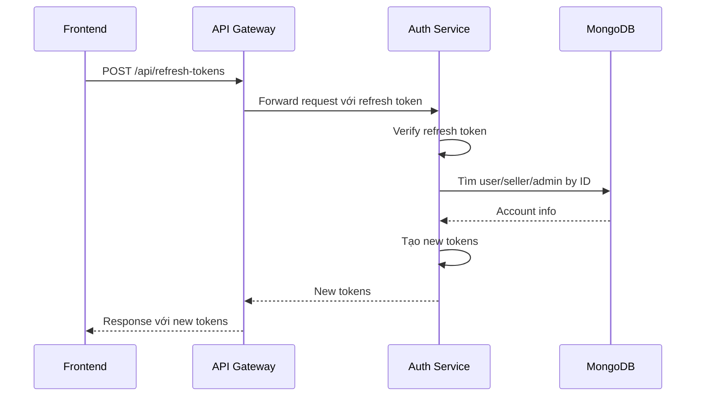
```mermaid
sequenceDiagram
    participant UI as Frontend
    participant GW as API Gateway
    participant AS as Auth Service
    participant DB as MongoDB
    
    UI->>GW: POST /api/refresh-tokens
    GW->>AS: Forward request với refresh token
    AS->>AS: Verify refresh token
    AS->>DB: Tìm user/seller/admin by ID
    DB-->>AS: Account info
    AS->>AS: Tạo new tokens
    AS-->>GW: New tokens
    GW-->>UI: Response với new tokens
```

## 2. Quy trình Quản lý Seller

### 2.1 Đăng ký Seller mới

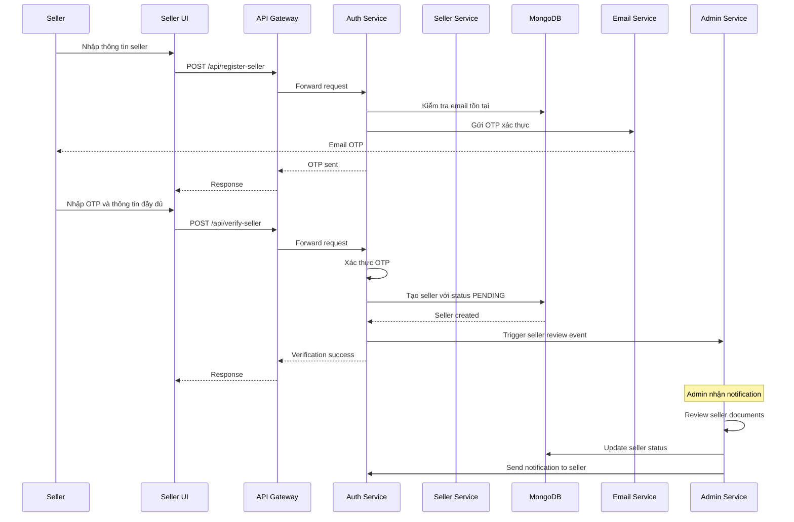
```mermaid
sequenceDiagram
    participant S as Seller
    participant SI as Seller UI
    participant GW as API Gateway
    participant AS as Auth Service
    participant SS as Seller Service
    participant DB as MongoDB
    participant Email as Email Service
    participant Admin as Admin Service
    
    S->>SI: Nhập thông tin seller
    SI->>GW: POST /api/register-seller
    GW->>AS: Forward request
    AS->>DB: Kiểm tra email tồn tại
    AS->>Email: Gửi OTP xác thực
    Email-->>S: Email OTP
    AS-->>GW: OTP sent
    GW-->>SI: Response
    
    S->>SI: Nhập OTP và thông tin đầy đủ
    SI->>GW: POST /api/verify-seller
    GW->>AS: Forward request
    AS->>AS: Xác thực OTP
    AS->>DB: Tạo seller với status PENDING
    DB-->>AS: Seller created
    AS->>Admin: Trigger seller review event
    AS-->>GW: Verification success
    GW-->>SI: Response
    
    Note over Admin: Admin nhận notification
    Admin->>Admin: Review seller documents
    Admin->>DB: Update seller status
    Admin->>AS: Send notification to seller
```

**Các bước chi tiết:**
1. Seller nhập thông tin cơ bản (name, email)
2. Gửi OTP xác thực email
3. Seller nhập OTP và thông tin đầy đủ (phone, country, password)
4. Tạo seller với status `PENDING`
5. Admin nhận notification để review
6. Admin duyệt/reject seller
7. Cập nhật status seller thành `APPROVED` hoặc `REJECTED`

### 2.2 Tích hợp Stripe cho Seller

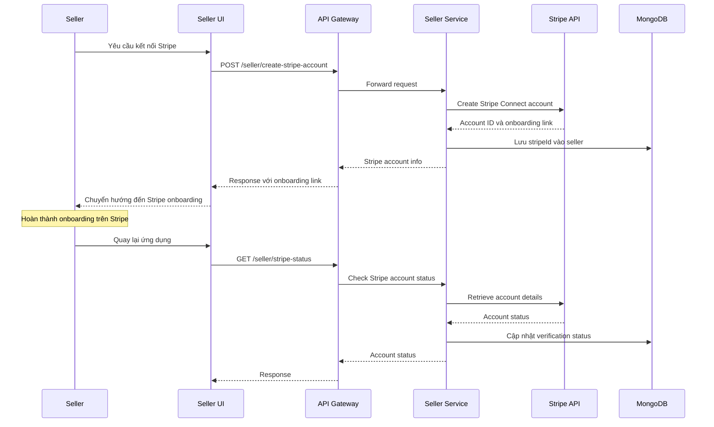
```mermaid
sequenceDiagram
    participant S as Seller
    participant SI as Seller UI
    participant GW as API Gateway
    participant SS as Seller Service
    participant Stripe as Stripe API
    participant DB as MongoDB
    
    S->>SI: Yêu cầu kết nối Stripe
    SI->>GW: POST /seller/create-stripe-account
    GW->>SS: Forward request
    SS->>Stripe: Create Stripe Connect account
    Stripe-->>SS: Account ID và onboarding link
    SS->>DB: Lưu stripeId vào seller
    SS-->>GW: Stripe account info
    GW-->>SI: Response với onboarding link
    SI-->>S: Chuyển hướng đến Stripe onboarding
    
    Note over S: Hoàn thành onboarding trên Stripe
    S->>SI: Quay lại ứng dụng
    SI->>GW: GET /seller/stripe-status
    GW->>SS: Check Stripe account status
    SS->>Stripe: Retrieve account details
    Stripe-->>SS: Account status
    SS->>DB: Cập nhật verification status
    SS-->>GW: Account status
    GW-->>SI: Response
```

## 3. Quy trình Quản lý Sản phẩm

### 3.1 Tạo Sản phẩm mới

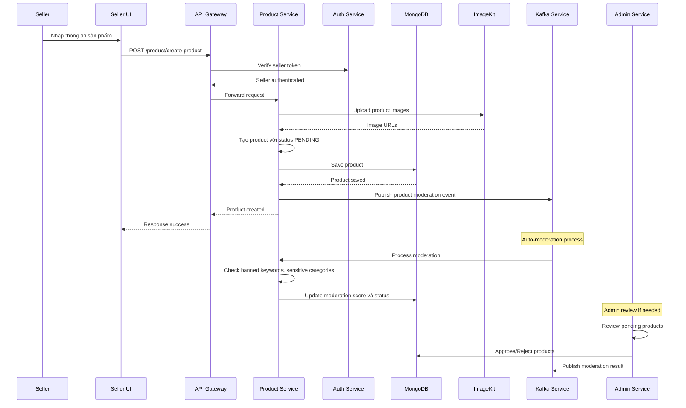
```mermaid
sequenceDiagram
    participant S as Seller
    participant SI as Seller UI
    participant GW as API Gateway
    participant PS as Product Service
    participant AS as Auth Service
    participant DB as MongoDB
    participant IK as ImageKit
    participant Kafka as Kafka Service
    participant Admin as Admin Service
    
    S->>SI: Nhập thông tin sản phẩm
    SI->>GW: POST /product/create-product
    GW->>AS: Verify seller token
    AS-->>GW: Seller authenticated
    GW->>PS: Forward request
    
    PS->>IK: Upload product images
    IK-->>PS: Image URLs
    PS->>PS: Tạo product với status PENDING
    PS->>DB: Save product
    DB-->>PS: Product saved
    PS->>Kafka: Publish product moderation event
    PS-->>GW: Product created
    GW-->>SI: Response success
    
    Note over Kafka: Auto-moderation process
    Kafka->>PS: Process moderation
    PS->>PS: Check banned keywords, sensitive categories
    PS->>DB: Update moderation score và status
    
    Note over Admin: Admin review if needed
    Admin->>Admin: Review pending products
    Admin->>DB: Approve/Reject products
    Admin->>Kafka: Publish moderation result
```

**Các bước chi tiết:**
1. Seller nhập thông tin sản phẩm (title, description, price, images, etc.)
2. Upload images lên ImageKit
3. Tạo product với status `PENDING`
4. Auto-moderation kiểm tra nội dung
5. Nếu score >= 90, auto approve
6. Nếu score < 90, gửi cho admin review
7. Admin có thể approve/reject với lý do

### 3.2 Quản lý Product Variations

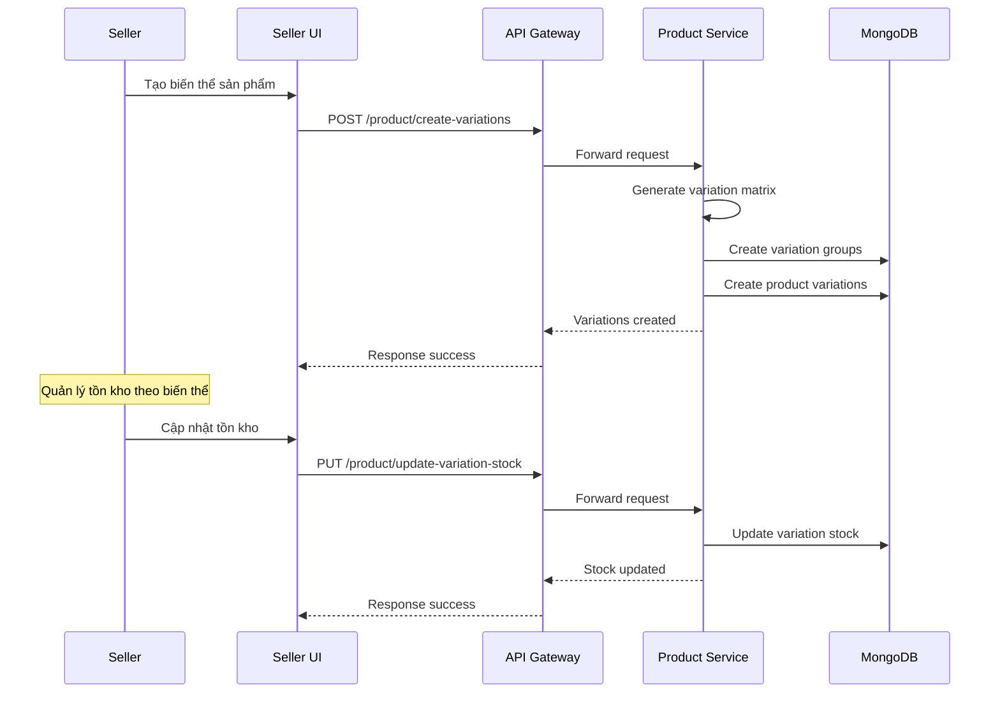
```mermaid
sequenceDiagram
    participant S as Seller
    participant SI as Seller UI
    participant GW as API Gateway
    participant PS as Product Service
    participant DB as MongoDB
    
    S->>SI: Tạo biến thể sản phẩm
    SI->>GW: POST /product/create-variations
    GW->>PS: Forward request
    PS->>PS: Generate variation matrix
    PS->>DB: Create variation groups
    PS->>DB: Create product variations
    PS-->>GW: Variations created
    GW-->>SI: Response success
    
    Note over S: Quản lý tồn kho theo biến thể
    S->>SI: Cập nhật tồn kho
    SI->>GW: PUT /product/update-variation-stock
    GW->>PS: Forward request
    PS->>DB: Update variation stock
    PS-->>GW: Stock updated
    GW-->>SI: Response success
```

## 4. Quy trình Đặt hàng & Thanh toán

### 4.1 Tạo Đơn hàng mới

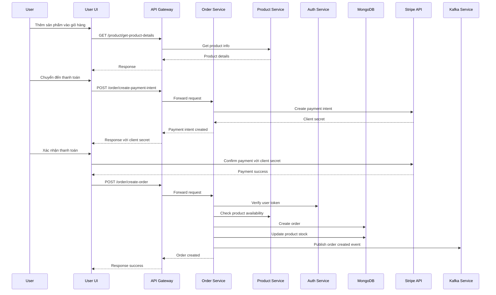
```mermaid
sequenceDiagram
    participant U as User
    participant UI as User UI
    participant GW as API Gateway
    participant OS as Order Service
    participant PS as Product Service
    participant AS as Auth Service
    participant DB as MongoDB
    participant Stripe as Stripe API
    participant Kafka as Kafka Service
    
    U->>UI: Thêm sản phẩm vào giỏ hàng
    UI->>GW: GET /product/get-product-details
    GW->>PS: Get product info
    PS-->>GW: Product details
    GW-->>UI: Response
    
    U->>UI: Chuyển đến thanh toán
    UI->>GW: POST /order/create-payment-intent
    GW->>OS: Forward request
    OS->>Stripe: Create payment intent
    Stripe-->>OS: Client secret
    OS-->>GW: Payment intent created
    GW-->>UI: Response với client secret
    
    U->>UI: Xác nhận thanh toán
    UI->>Stripe: Confirm payment với client secret
    Stripe-->>UI: Payment success
    UI->>GW: POST /order/create-order
    GW->>OS: Forward request
    OS->>AS: Verify user token
    OS->>PS: Check product availability
    OS->>DB: Create order
    OS->>DB: Update product stock
    OS->>Kafka: Publish order created event
    OS-->>GW: Order created
    GW-->>UI: Response success
```

### 4.2 Xử lý Webhook từ Stripe

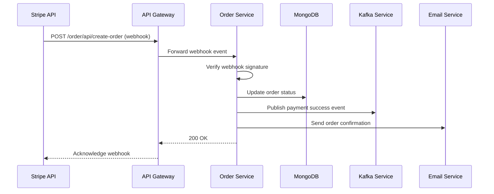
```mermaid
sequenceDiagram
    participant Stripe as Stripe API
    participant GW as API Gateway
    participant OS as Order Service
    participant DB as MongoDB
    participant Kafka as Kafka Service
    participant Email as Email Service
    
    Stripe->>GW: POST /order/api/create-order (webhook)
    GW->>OS: Forward webhook event
    OS->>OS: Verify webhook signature
    OS->>DB: Update order status
    OS->>Kafka: Publish payment success event
    OS->>Email: Send order confirmation
    OS-->>GW: 200 OK
    GW-->>Stripe: Acknowledge webhook
```

### 4.3 Cập nhật Trạng thái Giao hàng

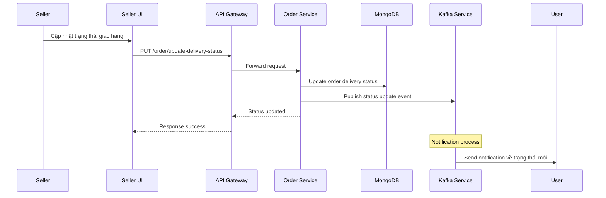
```mermaid
sequenceDiagram
    participant S as Seller
    participant SI as Seller UI
    participant GW as API Gateway
    participant OS as Order Service
    participant DB as MongoDB
    participant Kafka as Kafka Service
    participant U as User
    
    S->>SI: Cập nhật trạng thái giao hàng
    SI->>GW: PUT /order/update-delivery-status
    GW->>OS: Forward request
    OS->>DB: Update order delivery status
    OS->>Kafka: Publish status update event
    OS-->>GW: Status updated
    GW-->>SI: Response success
    
    Note over Kafka: Notification process
    Kafka->>U: Send notification về trạng thái mới
```

## 5. Quy trình Moderation Nội dung

### 5.1 Auto Moderation Sản phẩm

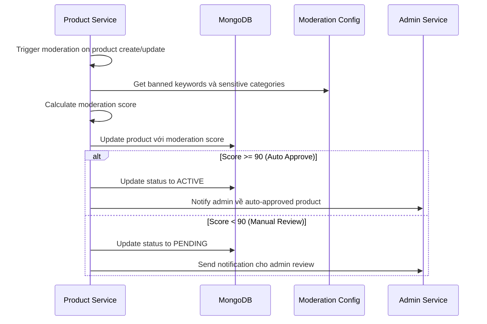
```mermaid
sequenceDiagram
    participant PS as Product Service
    participant DB as MongoDB
    participant MC as Moderation Config
    participant Admin as Admin Service
    
    PS->>PS: Trigger moderation on product create/update
    PS->>MC: Get banned keywords và sensitive categories
    PS->>PS: Calculate moderation score
    PS->>DB: Update product với moderation score
    
    alt Score >= 90 (Auto Approve)
        PS->>DB: Update status to ACTIVE
        PS->>Admin: Notify admin về auto-approved product
    else Score < 90 (Manual Review)
        PS->>DB: Update status to PENDING
        PS->>Admin: Send notification cho admin review
    end
```

### 5.2 Admin Review Process

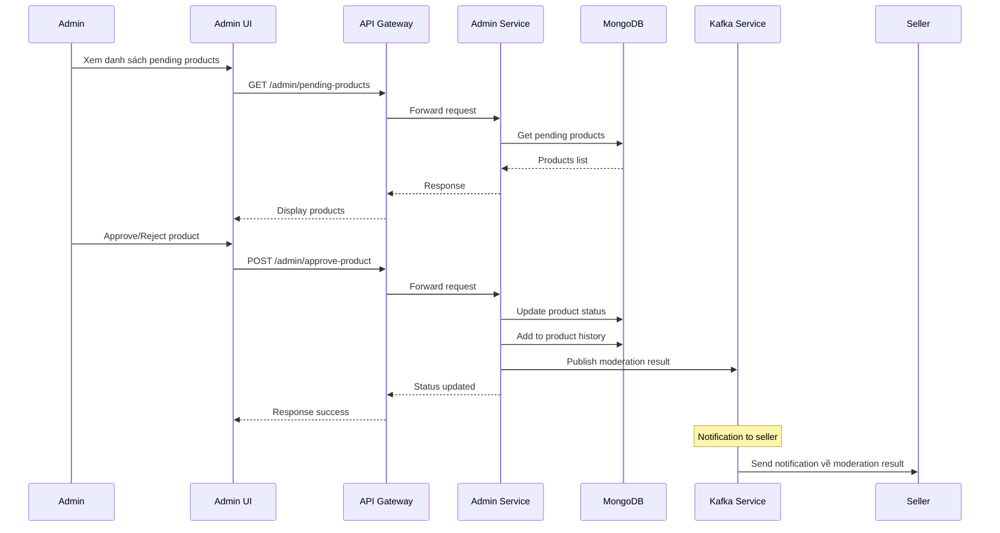
```mermaid
sequenceDiagram
    participant A as Admin
    participant AI as Admin UI
    participant GW as API Gateway
    participant AS as Admin Service
    participant DB as MongoDB
    participant Kafka as Kafka Service
    participant S as Seller
    
    A->>AI: Xem danh sách pending products
    AI->>GW: GET /admin/pending-products
    GW->>AS: Forward request
    AS->>DB: Get pending products
    DB-->>AS: Products list
    AS-->>GW: Response
    GW-->>AI: Display products
    
    A->>AI: Approve/Reject product
    AI->>GW: POST /admin/approve-product
    GW->>AS: Forward request
    AS->>DB: Update product status
    AS->>DB: Add to product history
    AS->>Kafka: Publish moderation result
    AS-->>GW: Status updated
    GW-->>AI: Response success
    
    Note over Kafka: Notification to seller
    Kafka->>S: Send notification về moderation result
```

## 6. Quy trình Analytics & Notifications

### 6.1 User Behavior Tracking

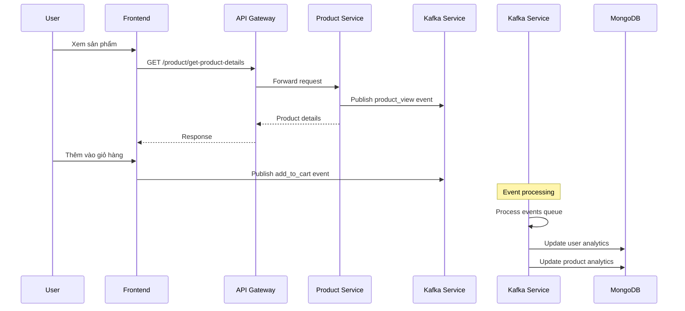
```mermaid
sequenceDiagram
    participant U as User
    participant UI as Frontend
    participant GW as API Gateway
    participant PS as Product Service
    participant Kafka as Kafka Service
    participant KS as Kafka Service
    participant DB as MongoDB
    
    U->>UI: Xem sản phẩm
    UI->>GW: GET /product/get-product-details
    GW->>PS: Forward request
    PS->>Kafka: Publish product_view event
    PS-->>GW: Product details
    GW-->>UI: Response
    
    U->>UI: Thêm vào giỏ hàng
    UI->>Kafka: Publish add_to_cart event
    
    Note over KS: Event processing
    KS->>KS: Process events queue
    KS->>DB: Update user analytics
    KS->>DB: Update product analytics
```

### 6.2 Notification System

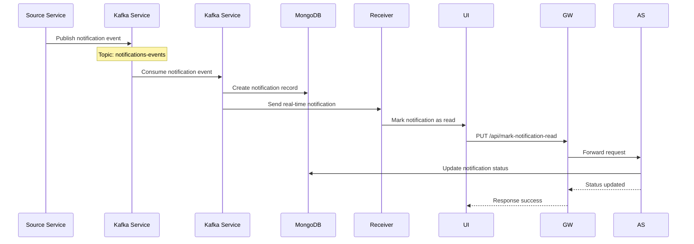
```mermaid
sequenceDiagram
    participant S as Source Service
    participant Kafka as Kafka Service
    participant KS as Kafka Service
    participant DB as MongoDB
    participant R as Receiver
    
    S->>Kafka: Publish notification event
    Note over Kafka: Topic: notifications-events
    Kafka->>KS: Consume notification event
    KS->>DB: Create notification record
    KS->>R: Send real-time notification
    
    R->>UI: Mark notification as read
    UI->>GW: PUT /api/mark-notification-read
    GW->>AS: Forward request
    AS->>DB: Update notification status
    AS-->>GW: Status updated
    GW-->>UI: Response success
```

## 7. Quy trình Quản lý Shop

### 7.1 Tạo và Quản lý Shop

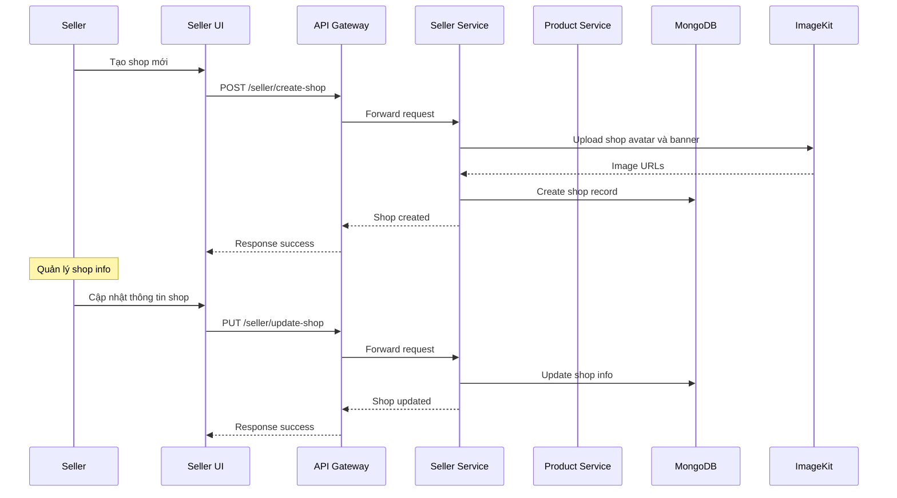
```mermaid
sequenceDiagram
    participant S as Seller
    participant SI as Seller UI
    participant GW as API Gateway
    participant SS as Seller Service
    participant PS as Product Service
    participant DB as MongoDB
    participant IK as ImageKit
    
    S->>SI: Tạo shop mới
    SI->>GW: POST /seller/create-shop
    GW->>SS: Forward request
    SS->>IK: Upload shop avatar và banner
    IK-->>SS: Image URLs
    SS->>DB: Create shop record
    SS-->>GW: Shop created
    GW-->>SI: Response success
    
    Note over S: Quản lý shop info
    S->>SI: Cập nhật thông tin shop
    SI->>GW: PUT /seller/update-shop
    GW->>SS: Forward request
    SS->>DB: Update shop info
    SS-->>GW: Shop updated
    GW-->>SI: Response success
```

### 7.2 Shop Following System

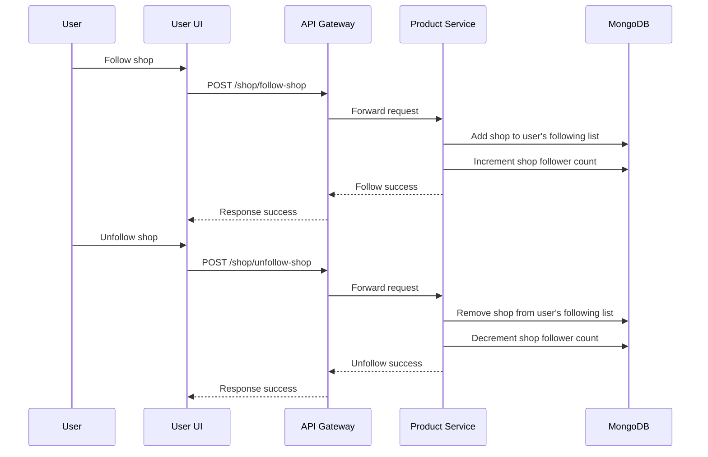
```mermaid
sequenceDiagram
    participant U as User
    participant UI as User UI
    participant GW as API Gateway
    participant PS as Product Service
    participant DB as MongoDB
    
    U->>UI: Follow shop
    UI->>GW: POST /shop/follow-shop
    GW->>PS: Forward request
    PS->>DB: Add shop to user's following list
    PS->>DB: Increment shop follower count
    PS-->>GW: Follow success
    GW-->>UI: Response success
    
    U->>UI: Unfollow shop
    UI->>GW: POST /shop/unfollow-shop
    GW->>PS: Forward request
    PS->>DB: Remove shop from user's following list
    PS->>DB: Decrement shop follower count
    PS-->>GW: Unfollow success
    GW-->>UI: Response success
```

## 8. Quy trình Discount & Promotion

### 8.1 Tạo Discount Code

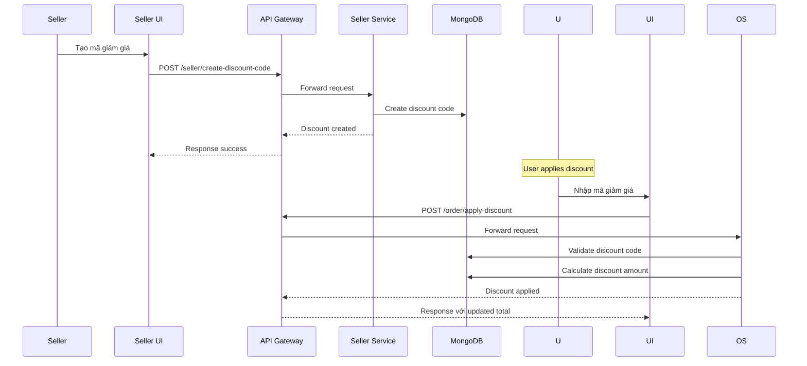
```mermaid
sequenceDiagram
    participant S as Seller
    participant SI as Seller UI
    participant GW as API Gateway
    participant SS as Seller Service
    participant DB as MongoDB
    
    S->>SI: Tạo mã giảm giá
    SI->>GW: POST /seller/create-discount-code
    GW->>SS: Forward request
    SS->>DB: Create discount code
    SS-->>GW: Discount created
    GW-->>SI: Response success
    
    Note over U: User applies discount
    U->>UI: Nhập mã giảm giá
    UI->>GW: POST /order/apply-discount
    GW->>OS: Forward request
    OS->>DB: Validate discount code
    OS->>DB: Calculate discount amount
    OS-->>GW: Discount applied
    GW-->>UI: Response với updated total
```

## 9. Quy trình Reviews & Ratings

### 9.1 Shop Review System

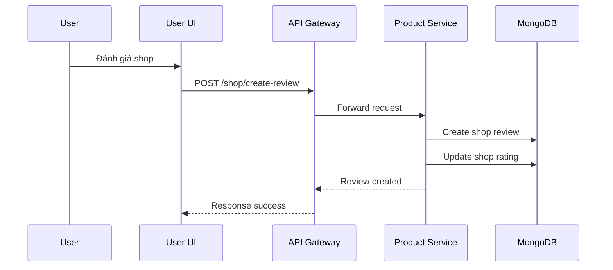
```mermaid
sequenceDiagram
    participant U as User
    participant UI as User UI
    participant GW as API Gateway
    participant PS as Product Service
    participant DB as MongoDB
    
    U->>UI: Đánh giá shop
    UI->>GW: POST /shop/create-review
    GW->>PS: Forward request
    PS->>DB: Create shop review
    PS->>DB: Update shop rating
    PS-->>GW: Review created
    GW-->>UI: Response success
```

## 10. Quy trình Address Management

### 10.1 User Address Management

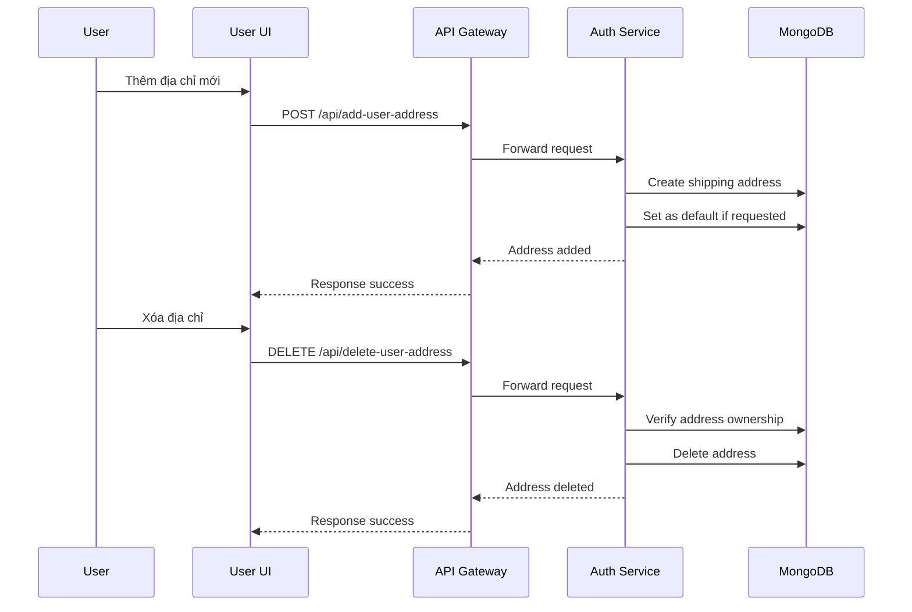
```mermaid
sequenceDiagram
    participant U as User
    participant UI as User UI
    participant GW as API Gateway
    participant AS as Auth Service
    participant DB as MongoDB
    
    U->>UI: Thêm địa chỉ mới
    UI->>GW: POST /api/add-user-address
    GW->>AS: Forward request
    AS->>DB: Create shipping address
    AS->>DB: Set as default if requested
    AS-->>GW: Address added
    GW-->>UI: Response success
    
    U->>UI: Xóa địa chỉ
    UI->>GW: DELETE /api/delete-user-address
    GW->>AS: Forward request
    AS->>DB: Verify address ownership
    AS->>DB: Delete address
    AS-->>GW: Address deleted
    GW-->>UI: Response success
```

## Kết luận

